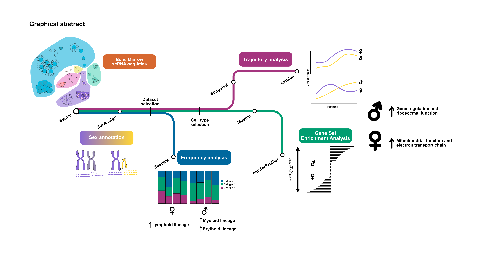

# Sex differences in hematopoiesis, a systems immunology approach


This repository contains the Seurat single-cell RNAseq analysis of bone marrow data.




## Project structure

The project has the following files and directories:

- **Main_dir/**: This directory contains the main scripts and notebooks for the analysis.
- **README.md**: This file provides an overview of the project and its contents.
- **conda_env.md**: This file lists the conda environment and packages used for the analysis for manual installation.
- **r-integration.yaml**: This file contains the instruction for a automatic installation of all the packages in the conda environment.

## How to use

To use this project, follow these steps:

1. Clone or download this repository to your local machine.
2. Create and activate the conda environment (See installation section).
3. Go to the **Main_dir/** directory and run the scripts or notebooks as needed (See run section).


## Installation

Run the following commands to install the conda environment:

```bash
conda env create --file r-integration.yaml -n r-integration
conda activate r-integration
```
Next install the R packages using the following command:

```r
remotes::install_github("JinmiaoChenLab/FastIntegrate")
BiocManager::install("BiocParallel")
remotes::install_github("phipsonlab/speckle", build_vignettes = TRUE, dependencies = "Suggest")
remotes::install_github("phipsonlab/cellxy")
remotes::install_github("saeyslab/muscatWrapper")
```

## Run
Go to the **Main_dir/** directory and into every subdirectory and run the scripts or notebooks as needed.

Here's a brief overview of what they do:
### 01_setup

**01_setup**: This directory contains the scripts to download the data and prepare the Seurat objects.
-  Adds new metadata to the Seurat objects (simplified cell types and lineages).
-  Predicts sex with the SexAssign.R script.
-  Generates plots to visualize the data on UMAP and PCA projections.
-  Saves the Seurat objects as .rds files for further analysis.
- Creates Figure 2 of the manuscript.

### 02_CellFrequency
**02_CellFrequency**: This directory contains to evaluate the cell frequency of the different cell types and lineages in the bone marrow.
-  Generates plots to visualize the cell frequency of the different cell types and lineages in the bone marrow against different covariates.
- Applies statistical tests to evaluate the differences in cell frequency between the different covariates with Speckle's propeller,
- Creates Figure 3 of the manuscript.

### 03_TrajectoryAnalysis
**03_TrajectoryAnalysis**: This directory contains the scripts to perform the trajectory analysis of the different cell types and lineages in the bone marrow with Slingshot and Lamian.
-  Splits the dataset into different hematopoietic lineages.   
- Infers the trajectories of the different lineages with Slingshot (Figure 4 of the manuscript).
- Evaluates differential expression between the different lineages with Lamian (Figure 5 of the manuscript).

### 04_GSEA
**04_GSEA**: This directory contains the scripts to perform the gene set enrichment analysis of the different cell types and lineages in the bone marrow with GSEA. It uses muscat to obtain a ranked gene list of the different cell types, and then uses clusterProfiler to perform the GSEA.
- Applies differential gene expression analysis between the different cell types with muscat.
- Performs GSEA with clusterProfiler's compareCluster function.
- Creates Figure 6 of the manuscript.

### scripts
**scripts**: This directory contains some scripts with R functions used in this project.
- SexAssign.R: Predicts sex with cellXY package, assigns sex to samples with the user's parameters. Finally, it returns the annotated Seurat object, a heatmap of X and Y genes used for the prediction and cell sex frequency plots, as well as a summary table of the results.
- cell_pal.R: This script generates a color palette for the different cell types and lineages in the bone marrow.
- lamian_downstream.R: This script performs the downstream analysis of the Lamian results. It generates a heatmap of the top 100 differentially expressed genes between the different lineages, and a violin plot of the top 10 differentially expressed genes between the different lineages.
- mod_plotClusterMeanAndDiff.R: This script modifies the plotClusterMeanAndDiff function from lamian to account for an error handling issue.
- mod_plotXDEHm.R: This script modifies the plotXDEHm function from lamian to account for an error handling issue.
- plot_lineage.R: This script generates a plot of the different lineages in the bone marrow from a slingshot object.
- run_lamian.R: This script runs the lamian analysis on the different lineages in the bone marrow.
